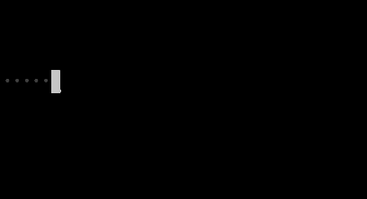
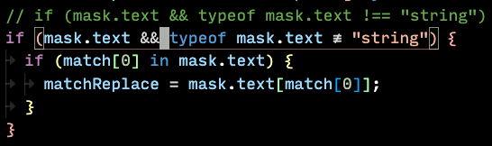
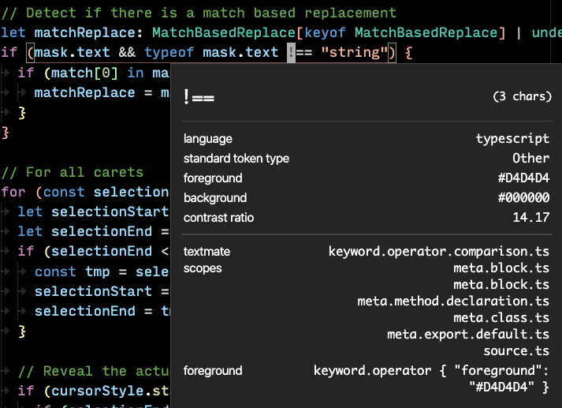

# Symbol Masks

Mask symbols in your code with custom styles and replacement text.



## Prerequisites

### Windows

You will need to install [Windows Build Tools](https://www.npmjs.com/package/windows-build-tools) before installing this extension for it to work properly.

## Usage

Masks are applied to every visible editor, so documents opened side by side are all masked. The symbol under your cursor is revealed in the editor you are typing in.

Specify a pattern that will match a symbol to be masked in your settings.json file:

```json
"symbolMasks.masks": [
  {
    "language": "plaintext",
    "patterns": [
        {
            "pattern": "(?<=\\b)lambda(?=\\b)",
            "replace": "λ",
            "style": {
              "fontWeight": "bold"
            }
        }
    ]
  }
]
```

Each pattern is a JavaScript regular expression. Set `"ignoreCase": true` for the `i` flag and `"multiline": true` for the `m` flag (so `^` and `$` match at line boundaries instead of the start and end of the document).

### Mask Multiple Symbols At Once

For efficiency, you can also match many symbols at once and map each of them to an individual mask:

```json
"symbolMasks.masks": [
  {
    "language": "plaintext",
    "patterns": [
        {
            "pattern": "(?<=\\b)(lambda|omega)(?=\\b)",
            "replace": {
              "lambda": {
                  "text": "λ",
                  "fontWeight": "bold"
              },
              "omega": {
                  "text": "ω"
              }
            }
        }
    ]
  }
]
```

### Mask Based On TextMate Scope

Creating more intelligent masks is as simple as specifying a textmate scope the mask should look for. This can be done in both single and multiple masking mode:

```json
"symbolMasks.masks": [
  {
    "language": "typescript",
    "patterns": [
      {
        "pattern": "!==|!=",
        "replace": {
          "!=": {
            "scope": "keyword.operator.comparison",
            "text": "≉"
          },
          "!==": {
              "scope": "keyword.operator.comparison",
              "text": "≢"
          }
        }
      }
    ]
  }
]
```

The result:



Since the `!==` in the comment does not match the specified scope, it doesn't get masked.

To find find the scopes for a given symbol, simply run `Ctrl+Shift+P` and the command `Developer: Inspect Editor Tokens and Scopes`:



## Importing From prettify-symbols-mode

If you have a substitution list for [prettify-symbols-mode](https://marketplace.visualstudio.com/items?itemName=siegebell.prettify-symbols-mode), run `Ctrl+Shift+P` and the command `Symbol Masks: Import prettify-symbols-mode substitutions`. It reads `prettifySymbolsMode.substitutions` from your user or workspace settings, converts it, and asks whether to append the result to your existing `symbolMasks.masks`, replace them, or just open the converted masks in a new document so you can paste them yourself. Nothing is written until you pick.

How the conversion works:

- `"pre"` and `"post"` become a lookbehind and lookahead around `"ugly"`: `{ "ugly": "fun", "pre": "\\b", "post": "\\b" }` becomes `(?<=(?:\\b))(?:fun)(?=(?:\\b))`
- prettify-symbols-mode matches line by line, so a `^` or `$` in `"pre"`/`"post"` turns on `"multiline": true`
- Substitutions whose `"ugly"` is plain text (not a regex) and which share the same `"pre"`, `"post"`, `"scope"` and `"style"` are folded into one match based pattern, longest symbol first
- `"scope"` is kept. Note that Symbol Masks checks the scope of the first character of a match, while prettify-symbols-mode required the whole token to match
- `"style"`: `color`, `backgroundColor` and `border` are kept, `textDecoration` and `hackCSS` go into `css`. Theme colours and `light`/`dark` blocks are dropped, and the command tells you which ones
- `"revealOn"`, `"adjustCursorMovement"` and `"prettyCursor"` have no equivalent and are ignored

